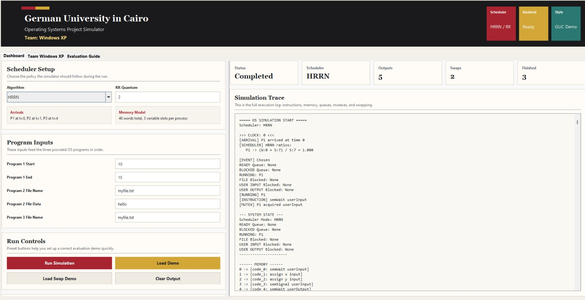
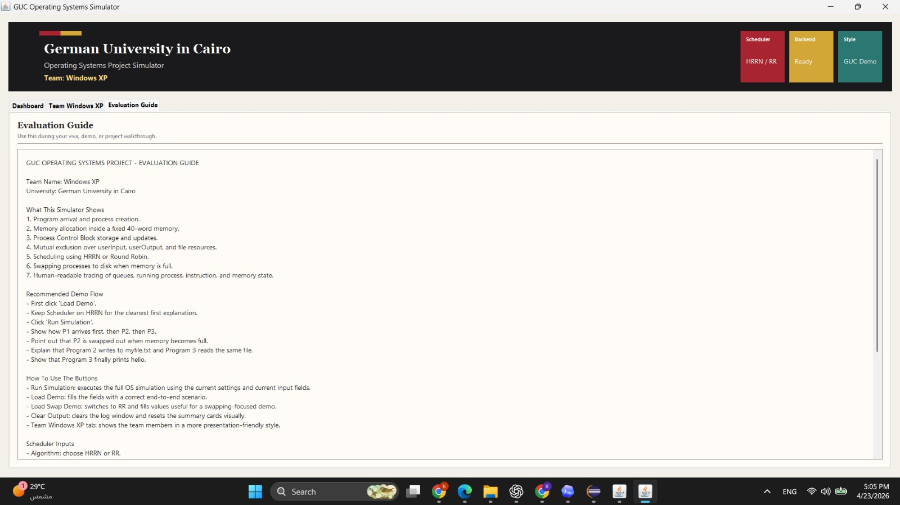

# OS Simulator

A Java-based operating system simulator that demonstrates process scheduling, memory management, mutual exclusion, system calls, and disk swapping through both a console trace and a Swing desktop interface.

## Overview

This project simulates the execution lifecycle of multiple programs inside a simplified operating system. Each program is loaded into a fixed-size memory model, assigned a process control block (PCB), scheduled according to a selected CPU scheduling algorithm, and executed instruction by instruction by a custom interpreter.

The simulator was built as an academic operating systems project and prepared for public portfolio review to demonstrate practical understanding of OS concepts, Java application design, and end-to-end simulation tracing.

## Problem Statement

Operating systems coordinate multiple competing programs while managing limited CPU time, memory, files, and shared resources. This project models those responsibilities in a controlled simulator so users can observe:

- How processes arrive, move between ready/running/blocked/finished states, and leave the system.
- How different scheduling algorithms affect execution order.
- How fixed memory constraints force swapping decisions.
- How semaphores prevent unsafe concurrent access to shared resources.
- How system calls connect user programs to input, output, memory, and file operations.

## Features

- Process creation from text-based program files.
- Process Control Block tracking for process ID, state, program counter, memory bounds, burst time, waiting time, and MLFQ level.
- Instruction interpreter for `assign`, `print`, `printFromTo`, `readFile`, `writeFile`, `semWait`, and `semSignal`.
- Three CPU scheduling modes:
  - Highest Response Ratio Next (HRRN)
  - Round Robin (RR) with configurable quantum
  - Multi-Level Feedback Queue (MLFQ) with four queues and exponential quantums
- Fixed 40-word memory model with contiguous allocation.
- Variable storage and PCB synchronization inside simulated memory.
- Disk swapping through generated process disk-image files.
- Mutex/semaphore simulation for `userInput`, `userOutput`, and `file`.
- Detailed console trace of clock cycles, queues, memory, running instructions, blocking, unblocking, and swapping.
- Swing GUI dashboard with algorithm selection, demo presets, metrics, and execution log.

## System Architecture

```text
Text Programs
    |
    v
ProgramLoader ---> Memory
    |              |-- code segment
    |              |-- variable segment
    |              |-- PCB segment
    v
Process + PCB ---> Scheduler
    |              |-- HRRN
    |              |-- Round Robin
    |              |-- MLFQ
    v
Interpreter ---> SystemCalls
    |              |-- console output
    |              |-- user input
    |              |-- file read/write
    v
MutexManager ---> blocked/resource queues
    |
    v
Swap files when memory is full
```

The application separates core simulator responsibilities into focused packages:

- `os.interpreter`: loads and executes program instructions.
- `os.scheduler`: selects the next process according to the active scheduling policy.
- `os.memory`: models memory words, allocation, PCB sync, and swapping.
- `os.mutex`: manages semaphore ownership and blocked queues.
- `os.process`: stores process and PCB state.
- `os.syscall`: exposes simplified operating system services.
- `os.gui`: provides the Swing user interface.

## Technologies Used

- Java
- Java Swing
- Java Collections Framework
- File I/O
- Object-oriented design
- Eclipse project metadata

## Algorithms and Data Structures

- HRRN scheduling using response ratio: `(waiting time + burst time) / burst time`.
- Round Robin scheduling using a FIFO ready queue.
- MLFQ scheduling using multiple queues, priority-based dispatch, preemption, and demotion.
- Contiguous first-fit memory allocation over a fixed-size word array.
- Swap victim selection based on memory fit and process state.
- Semaphore resource locking with per-resource blocked queues.
- PCB state synchronization between process objects and simulated memory.

## Design Decisions and Patterns

- Singleton-style memory manager through `Memory.getInstance()` to represent one shared physical memory space.
- Layered package structure separating scheduling, memory, interpretation, synchronization, system calls, process state, and GUI concerns.
- State-machine style process lifecycle using ready, running, blocked, and finished states.
- Queue-based coordination for ready processes, MLFQ priority levels, blocked resources, and recently unblocked processes.
- Text-command interpreter pattern that maps program instructions to system call and mutex operations.
- GUI wrapper around the simulator engine, allowing the same core logic to run from the console or Swing interface.

## Installation

### Prerequisites

- JDK 8 or newer
- A terminal or an IDE such as Eclipse, IntelliJ IDEA, or VS Code with Java support

### Build from Terminal

```bash
cd OSSimulator
javac -d out $(find src -name "*.java")
```

On Windows PowerShell:

```powershell
cd OSSimulator
javac -d out (Get-ChildItem -Recurse -Filter *.java -Path src | ForEach-Object { $_.FullName })
```

## Usage

Run the console simulator:

```bash
java -cp out os.Main HRRN
java -cp out os.Main RR q=2
java -cp out os.Main MLFQ
```

Run the GUI:

```bash
java -cp out os.gui.SimulatorGUI
```

The simulator expects `Program1.txt`, `Program2.txt`, and `Program3.txt` to be available from the project working directory. The provided sample programs demonstrate user input, output, file access, and semaphore-protected resources.

## Project Structure

```text
OS-Simulator/
|-- README.md
|-- PORTFOLIO_GUIDE.md
|-- .gitignore
|-- OSSimulator/
|   |-- src/os/
|   |   |-- Main.java
|   |   |-- gui/
|   |   |-- interpreter/
|   |   |-- memory/
|   |   |-- mutex/
|   |   |-- process/
|   |   `-- syscall/
|   |-- Program1.txt
|   |-- Program2.txt
|   |-- Program3.txt
|   `-- *.txt demo/input files
`-- docs/
    `-- screenshots/
```

## Screenshots

### Simulation Dashboard



### Evaluation Guide



## Demo Video

[Watch the OS simulator demo](docs/demo/os-simulator-demo.mp4)

## Technical Challenges Solved

- Designing a small instruction language and interpreter.
- Keeping Java process objects synchronized with a simulated memory representation.
- Handling scheduling policies with different dispatch and preemption rules.
- Simulating memory pressure and swap-in/swap-out behavior.
- Preventing shared resource conflicts using semaphore-style mutexes.
- Presenting complex runtime state in a recruiter-friendly GUI and detailed logs.

## Future Improvements

- Add automated unit tests for scheduler selection, memory allocation, swapping, and mutex behavior.
- Convert the project to Maven or Gradle for easier builds and CI.
- Move sample programs into a dedicated `examples/` directory and make their paths configurable.
- Add a visual memory grid to the GUI instead of relying only on log output.
- Add exportable simulation reports for each run.
- Add GitHub Actions to compile the project on every push.
- Replace string-based process states with an enum.

## Key Learning Outcomes

- Applied operating systems concepts in executable Java code.
- Practiced CPU scheduling algorithms and tradeoffs.
- Modeled memory allocation, process control blocks, and swapping.
- Built synchronization primitives with queues and resource ownership.
- Improved debugging and explanation skills through detailed execution tracing.
- Created a GUI wrapper around a simulation engine without changing core logic.
